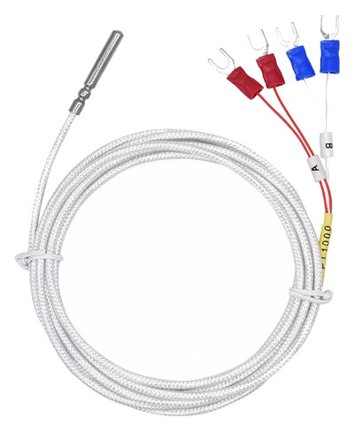
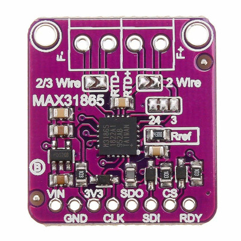

# Temperature Sensor ESP32

Termocouple on ESP32, with wifi support.

## Development

This project was developed with PlatformIO. Please refer to https://platformio.org/platformio-ide to install it.

## Hardware

### Microcontroller

This project is designed for an ESP32. Personaly, I use an ESP32 with an integrated oled screen (128x64).

If you want to connect your own oled screen, please use the following pins:
- GPIO21 (SCL)
- GPIO22 (SDA)

### Sensor

I made the choice to use a thermocouple with 4 wires for more accuracy.

### Sensor driver

As I use a 4-wire thermicouple, no modification has to be done on the driver. If you are using a 3-wire thermocouple, have a look on this page: https://www.makerguides.com/max31865-rtd-sensor-and-arduino-uno/#Connecting_the_3_wires

## Usage

Once the project uploaded on your ESP32, connect toyour machine and open a Serial Console.

Type `help` to list the available commandes.

### Configure wifi

Type `wifi-scan` to scan all reachable wifi. Note that ESP32 is able to connect to 2.4GHz wifi only.

Once the scan is complete, you can register your wifi network with the command: `wifi-conf ssid password`. (If you type `wifi-conf` with no parameter, the current config is displayed).

By default the device hostname is `temperature`. you can change it with the command: `hostname foo` (if you type `hostname` with no parameter, the current hostname is displayed).

### Restart the device

You can perform a soft reset with the command `restart`.

### Configure the sensor

You can set the number of wires used by your sensor. By default, it's 4. If you use a 3-wire (or 2-wire) sensor, type: `sensor-conf 3` (or `sensor-conf 2`).

you can check your sensor configuration with the command: `sensor-status`.

## Server

When correctly configured, the device exposes an HTTP server. For instance, if your hostname is `temperature`, you can browse http://temperature

Every second, the temperature is updated.